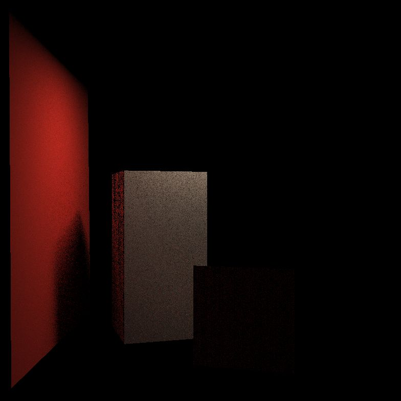

# 最终效果

# 调试过程
## 第一次提交的源码

## 修改 BVH

修改了BVH判定交的逻辑，多找到两个面，但是噪点和颜色有点怪，好像红色炸了
## 修改间接光系数

修正计算间接光的系数，能看到软阴影，还是丢面
## 修改间接光采样角度

修正计算间接光的采样角度wi，左侧可见间接光的 bleeding 效果，但是为什么还是丢面？
## 修改 BVH

重新整理一下 ，我的代码和框架定义的可能不太一致，但是迭代方向应该是正确的。
wo: 外面指向p。    ws: 光源指向p。    wi: p指向q。

打 log 测试表面正弦和 f_r 的值没有明显异常，但显示多数间接光计算时光线没有碰撞到表面，而是直接返回0。
同时注意到，近处的立方体的顶面没有正确遮挡住后面长方体。
推测不是光照计算错误，而是光线穿过了前景立方的顶面，在长方体处碰撞表面采样了。

检查 AABB 盒的求交结构
放宽相切检查 t0 < t1 改为 t0 <= t1 。
渲染时间暴涨，但是得到正确结果。

## 顶灯问题
和样例不一样，没有顶黑，推测是 EPS 小偏移绕开了。

想要显示灯直接加一下自发光项就好，这里的实现比较粗糙，直接加了顶灯的 emit 参数值。
